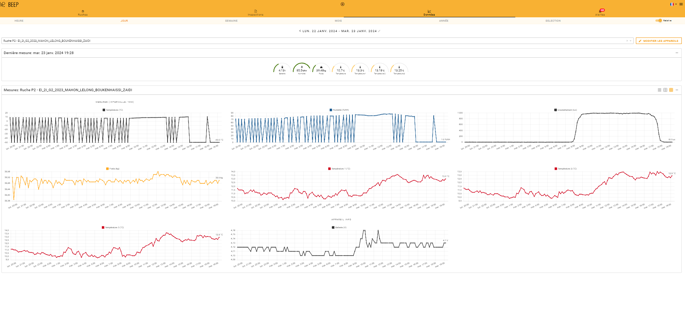

# Open Ruche Project Guide

## Project Overview

The Open Ruche project, an initiative within the EI2I program at Polytech Sorbonne, is a testament to the seamless integration of technology with environmental monitoring. This endeavor is dedicated to crafting an advanced Internet of Things (IoT) system focused on real-time beehive monitoring. The project not only pioneers in the domain of apiculture by enabling precision in data collection and analysis but also sets a new standard in the utilization of collected data.

Post-collection, the data undergoes a meticulous process of analysis and interpretation. This involves transforming raw sensor data into meaningful insights that provide a comprehensive understanding of beehive conditions. These insights are then made accessible to beekeepers and researchers through the Beep application programming interface (API), facilitating informed decision-making and proactive bee colony management.

In addition to its practical applications, Open Ruche is a stride toward innovation in the interplay of IoT and apiculture. It's not just about collecting data; it's about interpreting it to unlock new possibilities in beekeeping, from optimized hive conditions to preventive healthcare for bees. By combining state-of-the-art technology with a deep understanding of environmental science, Open Ruche is pioneering a new wave of smart apiculture that's in tune with the rhythms of nature and technology.

### Mission and Objectives

The mission of Open Ruche is to offer a cutting-edge, reliable solution for real-time beehive monitoring, addressing the pressing needs of beekeepers and researchers. In an era marked by environmental challenges impacting bee populations, Open Ruche emerges as a crucial ally. By monitoring critical parameters such as temperature, humidity, hive weight, and light exposure, the project doesn't just provide data; it offers a window into the life and health of bee colonies, contributing significantly to global food security and the preservation of biodiversity.

### Technical Approach

At the core of Open Ruche is a commitment to precision and reliability. Harnessing the latest in IoT technology, the project ensures that data on beehive conditions is accurately gathered and swiftly delivered. Through a synergy of meticulously chosen sensors and a robust communication framework (LoRaWAN), Open Ruche guarantees that beekeepers and researchers receive timely, actionable information, empowering them to make well-informed decisions.

## Hardware Details

### 1. MKRWAN Board
- Serving as the cornerstone of the monitoring system, the MKRWAN board is an Arduino-compatible board designed specifically for LoRaWAN communication. Its design is optimized for IoT applications, offering compactness and low power consumption, essential for efficient and unobtrusive beehive monitoring.

### 2. DHT22 Temperature and Humidity Sensors
- Selected for their precision, the DHT22 sensors accurately measure temperature and humidity levels within beehives, providing critical data for monitoring bee health and environmental conditions. Their robust single-wire digital interface ensures reliable readings even in the most demanding settings.

### 3. DS18B20 Temperature Sensors
- Employed for their precision in measuring external conditions, DS18B20 sensors are crucial in gauging the ambient environment surrounding the hives. They utilize the OneWire protocol, known for its efficiency and reliability, facilitating seamless integration into the system.

### 4. H401-C3 Load Cell and HX711 Amplifier
- At the heart of the weight monitoring capabilities lies the H401-C3 load cell, renowned for its precision and reliability. Paired with the HX711 amplifier, known for its low-noise analog-to-digital conversion, this duo forms a robust system capable of providing precise weight measurements, an integral metric for assessing hive health and activity.

### 5. Photoresistor
- Incorporated to measure ambient light conditions, the photoresistor provides contextual data, enhancing the understanding of the beehive's external environment. This insight is invaluable in assessing the influence of light on bee behavior and hive activity.

### 6. Buzzer
- The inclusion of a buzzer adds an auditory dimension to the system, offering real-time feedback and alerts. It serves various purposes, including diagnostics, connection status indication, and alerting beekeepers to specific hive conditions, thereby enhancing user interaction with the monitoring system.

### 7. Power Supply (LiPo Battery and Solar Panels) and TPL5110 Power Management Module
- The monitoring system is powered by a rechargeable LiPo battery, ensuring autonomy and continuous operation. The choice of a LiPo battery reflects the project's commitment to sustainability and energy efficiency.
- To efficiently manage power consumption and extend battery life, the TPL5110 power management module is employed. It ensures that the system operates only when necessary, conserving energy and prolonging battery life.

### Power Supply Considerations

#### LiPo Battery and Solar Panels Integration

The Open Ruche monitoring system relies on a carefully designed power supply system to ensure continuous operation. Here are the key components and considerations:

##### 1. LiPo Battery
- The system is powered by a rechargeable LiPo (Lithium-Polymer) battery with a nominal voltage of 3.7V and a maximum voltage of approximately 4.2V.
- The LiPo battery is selected for its energy density and rechargeable nature, making it an excellent choice for remote IoT applications like beehive monitoring.
- The battery's capacity is rated at 1050mAh, providing sufficient energy for extended operation.

##### 2. LiPo Rider Pro BMS (Battery Management System)
- To efficiently manage the LiPo battery's charging and ensure its longevity, the system incorporates the LiPo Rider Pro charging circuit.
- The LiPo Rider Pro is responsible for safely recharging the LiPo battery. It regulates the voltage from the connected solar panel to charge the battery effectively.
- This charging circuit includes safeguards to prevent overcharging and over-discharging, prolonging the LiPo battery's lifespan.

##### 3. Solar Panels
- Solar panels with dimensions of approximately 18cm by 8cm are integrated into the Open Ruche system to harness solar energy.
- These solar panels serve as a renewable power source, continuously recharging the LiPo battery during daylight hours.
- The energy harvested from the solar panels helps maintain the battery's charge and sustain the system's operation even in locations with limited access to traditional power sources.

##### 4. Power Consumption
- The system is designed with power-efficient components and sleep modes to minimize power consumption.
- Expected power consumption is carefully managed to ensure the system's autonomy and reduce the need for frequent battery recharging.
- Power management modules, such as the TPL5110, are utilized to control power states and optimize energy usage.

The integration of a LiPo battery and solar panels in the Open Ruche project provides a sustainable power solution for remote beehive monitoring. This setup ensures that the system can operate autonomously, continuously collect data, and contribute to the well-being of bee colonies.

These carefully selected components collectively enable the Open Ruche project to collect data effectively, ensuring the well-being of bee colonies and addressing the challenges faced by beekeepers in a sustainable and responsible manner.

### PCB Schematic
- Central to the project, the PCB integrates all the hardware components, ensuring seamless communication and functionality. It features dedicated connectors for the MKRWAN 1310, interfaces for the array of sensors, and the TPL5110 module for power management. The PCB's layout is meticulously designed to accommodate the system's requirements, offering a reliable and efficient platform for the Open Ruche monitoring system.

#### Key Features:
- **MKRWAN 1310 Interface:** The PCB includes a dedicated interface for seamless connection with the MKRWAN 1310 board. This interface ensures compatibility and efficient data transmission.

- **Sensor Connections:** Multiple sensors are accommodated through the PCB, allowing for the collection of crucial data. Detailed interfaces for each sensor type are provided on the PCB, enabling accurate measurements.

- **TPL5110 Integration:** To enhance power management and optimize energy consumption, the PCB integrates the TPL5110 module. This feature contributes to the project's low-power operation.

#### PCB Schematic Image


The image above displays the actual PCB schematic, providing a visual representation of the board's layout, connectors, and sensor interfaces.

## Hardware Setup

Setting up the hardware components of the Open Ruche project involves precise connections and configurations to ensure accurate data collection and seamless operation. Below are the detailed steps for connecting each component to the MKRWAN board.

### MKRWAN Board
- **Core of the System**: The MKRWAN board is the central unit that manages communication and data processing. Connect the board's power source and ensure it's properly configured for LoRaWAN communication.

### DHT22 Temperature and Humidity Sensors
- **Sensor Connection**: Connect the DHT22 sensors to pins `DHT2_PIN` and `DHT3_PIN` for temperature and humidity monitoring inside the beehive.
- **Digital Interface**: Utilize a single-wire digital interface for connecting the DHT22 sensors, ensuring stable and reliable data transmission.

### DS18B20 Temperature Sensors
- **OneWire Protocol**: Connect the DS18B20 sensors to the `ONE_WIRE_BUS` pin. These sensors use the OneWire protocol, allowing multiple sensors to share the same pin for data communication.
- **Ambient Temperature Monitoring**: Place these sensors in appropriate locations to effectively monitor the external temperature conditions surrounding the hive.

### H401-C3 Load Cell and HX711 Amplifier
- **Weight Monitoring Setup**: Connect the H401-C3 load cell to the HX711 amplifier, and then interface the amplifier with the `DOUT_PIN` and `CLK_PIN` on the MKRWAN board.
- **Stable Mounting**: Ensure that the load cell is securely mounted to measure the weight of the beehive accurately.

### Photoresistor
- **Light Measurement**: Connect the photoresistor to the `photoresistorPin` and `photoResistorVCCpin`. This setup is used to measure the ambient light levels, providing insights into the external light conditions affecting the beehive.

### Buzzer
- **Audible Feedback**: Attach the buzzer to the `BUZZER_PIN` to enable audio notifications or alerts as part of the system's interaction with the user.

### Power Supply
- **Battery Connection**: Connect the LiPo battery to the system, ensuring it powers the MKRWAN board and all connected sensors.
- **Power Management**: Integrate the TPL5110 module with the `DONE_PIN` and `REARM_PIN` for efficient power management. This module helps in reducing the power consumption by putting the system into sleep mode between data transmissions.

### LiPo Battery and Solar Panels Integration
- **Battery Charging**: Use the LiPo Rider Pro BMS for charging the LiPo battery. Connect the solar panels to the LiPo Rider Pro to harness solar energy for recharging the battery.
- **Voltage Monitoring**: Connect the `batteryVoltagePin` to the battery's voltage divider output to monitor the battery's voltage and ensure optimal power management.

After completing the hardware setup, ensure all connections are secure and double-check for any possible issues before powering up the system. Proper hardware setup is crucial for the reliability and accuracy of the Open Ruche monitoring system.


## Software Requirements

### 1. Arduino IDE
- We recommend using the Arduino IDE for programming the MKRWAN board and integrating the required libraries.

### 2. LoRaWAN Connectivity Setup
- Configure LoRaWAN connectivity using your chosen network provider (e.g., The Things Network - TTN).

## Setup Instructions

### 1. Assemble the Hardware
- Connect the sensors and components following the provided wiring diagram.

### 2. Configure the Arduino IDE
- Install necessary libraries for DHT, OneWire, DallasTemperature, HX711, and ArduinoLowPower.
- Set up the Arduino IDE for your MKRWAN board.

### 3. Configure LoRaWAN
- Obtain unique Application EUI and Application Key credentials from your LoRaWAN network provider (e.g., TTN).
- Update the `appEui` and `appKey` variables in the Arduino code with these credentials.

### 4. Sensor Calibration

#### Weight Sensor Calibration

The weight sensor used in the Open Ruche project, the H401-C3, requires calibration to provide accurate weight measurements. The calibration process involves determining the correct calibration factor that converts sensor readings into meaningful weight values.

Here are the steps to calibrate the weight sensor:

1. **Select a Reference Weight:** Begin by selecting a known reference weight. This weight should be accurately measured and preferably falls within the typical range of beehive weights you intend to monitor. Ensure that the reference weight is evenly distributed on the hive's weight-sensing platform.

2. **Place the Reference Weight:** Carefully place the reference weight on the hive's weight-sensing platform, ensuring it is centered and balanced. This step should be performed with precision to obtain accurate calibration.

3. **Record Sensor Reading:** Record the sensor reading corresponding to the applied reference weight. The sensor will provide a reading in a raw unit, which is not directly interpretable as weight.

4. **Calculate Calibration Factor:** To calculate the calibration factor, divide the known reference weight (in grams or kilograms) by the recorded sensor reading (in raw units). The formula is as follows:
   
   Calibration Factor = Reference Weight (grams or kilograms) / Sensor Reading (raw units)

   For example, if the reference weight is 1095 grams and the sensor reading is 1000 raw units, the calibration factor would be:
   
   Calibration Factor = 1095 grams / 1000 raw units = 1.095 grams/raw unit

5. **Apply Calibration Factor:** Once you have calculated the calibration factor, you can apply it to the sensor readings to convert raw units into weight values. Multiply the sensor readings by the calibration factor to obtain accurate weight measurements.

By following these steps, you can calibrate the weight sensor in the Open Ruche project to provide precise and reliable weight measurements of beehives. Calibration ensures that the system accurately monitors hive growth and provides valuable data to beekeepers.


## Code Implementation and Deployment

The software implementation process involves setting up your development environment, downloading the project's code, and uploading it to the MKRWAN board. Follow these steps to get your system up and running:

### Setting Up the Development Environment

1. **Install the Arduino IDE**:
   - Download and install the Arduino IDE from [the official Arduino website](https://www.arduino.cc/en/software).

2. **Configure the Arduino IDE for MKRWAN Board**:
   - Open the Arduino IDE.
   - Go to `Tools > Board > Boards Manager`.
   - Search for `MKRWAN` and install the board package for the MKRWAN series.

3. **Install Required Libraries**:
   - Open the Arduino IDE.
   - Go to `Sketch > Include Library > Manage Libraries`.
   - Install the following libraries:
     - `MKRWAN` by Arduino
     - `DHT sensor library` by Adafruit
     - `OneWire` by Paul Stoffregen
     - `DallasTemperature` by Miles Burton
     - `HX711` by bogde
     - `ArduinoLowPower` by Arduino

### Downloading the Project Code

1. **Clone the Repository**:
   - Ensure you have `git` installed on your system. If not, you can download it from [Git SCM](https://git-scm.com/downloads).
   - Open a terminal or command prompt.
   - Navigate to the directory where you want to clone the repository.
   - Run the following command:
     ```sh
     git clone https://github.com/OpenRuche-Mahon-Lelong-Zaidi/open-ruche.git
     ```
   - This will create a copy of the project in the `open-ruche` directory.

### Uploading the Code to the MKRWAN Board

1. **Open the Project in Arduino IDE**:
   - Open the Arduino IDE.
   - Go to `File > Open`.
   - Navigate to the `open-ruche` directory.
   - Open the `sendSensorsData.ino` file.

2. **Connect the MKRWAN Board to Your Computer**:
   - Use a suitable USB cable to connect the MKRWAN board to your computer.
   - Wait for the drivers to install if it's the first time you are connecting the board.

3. **Select the Correct Board and Port**:
   - In the Arduino IDE, go to `Tools > Board` and select the appropriate MKRWAN board from the list.
   - Go to `Tools > Port` and select the port that your MKRWAN board is connected to.

4. **Upload the Code**:
   - Click the `Upload` button (right arrow icon) in the Arduino IDE.
   - Wait for the code to compile and upload to the board. You should see a message in the console at the bottom of the Arduino IDE when the upload is successful.

After these steps, your MKRWAN board should be running the Open Ruche software, and you can proceed with the hardware setup and testing.

## Testing

### 1. Data Monitoring
- Monitor the data transmitted by your device via LoRaWAN on your chosen network provider's platform (for example, we used TTN Console for this project).
- Verify temperature, humidity, weight, light, and battery voltage data.

## Programming

The Open Ruche project is powered by an Arduino MKRWAN 1310 board, and its functionality is achieved through a combination of libraries and custom code. Below, we provide an overview of the code structure, libraries used, and how data is transmitted to the Things Network (TTN) and integrated with the Beep app API.

### Code Overview

You can find the code in the [src](https://github.com/OpenRuche-Mahon-Lelong-Zaidi/open-ruche/tree/main/src) folder.


The project's Arduino code [sendSensorsData.ino](https://github.com/OpenRuche-Mahon-Lelong-Zaidi/open-ruche/blob/main/src/arduino/sendSensorsData/sendSensorsData.ino) is organized into several sections, each responsible for specific tasks:

- **Initialization:** This section includes the setup of pins, sensors, and LoRa communication. It also initializes the modem and sets up Morse code signaling for system startup.

- **Sensor Initialization:** Here, the various sensors used in the project, such as DHT temperature and humidity sensors, DS18B20 temperature sensors, and the HX711 weight sensor, are initialized.

- **Main Loop:** The main loop of the program handles the core functionality. It includes functions to read sensor data, handle LoRa communication, and signal task completion. The system also enters a low-power sleep mode to conserve energy between data transmissions.

- **Display Functions:** These functions are used for debugging and can be uncommented to display sensor readings and battery percentage in the Serial Monitor.

- **LoRa Communication:** This section handles LoRa communication, including joining the TTN network and sending data packets.

### Libraries and Dependencies

The project relies on the following libraries and dependencies:

- `MKRWAN`: This library provides LoRaWAN communication capabilities for the Arduino MKRWAN board.

- `DHT`: The DHT library is used for reading temperature and humidity data from DHT22 sensors.

- `OneWire` and `DallasTemperature`: These libraries are employed for interfacing with DS18B20 temperature sensors using the OneWire protocol.

- `HX711`: The HX711 library allows communication with the HX711 weight sensor, used for hive weight monitoring.

- `ArduinoLowPower`: This library provides functions for managing low-power modes to extend battery life.

### Payload Formatter (TTN)

The payload formatter, an essential component in the TTN (The Things Network) console, plays a crucial role in the OpenRuche project. It is responsible for decoding the raw data received from the MKRWAN board, transforming it into human-readable information, and preparing it for further processing.

**Importance:**
- **Data Decoding:** The payload formatter is instrumental in translating the binary data transmitted by the MKRWAN board into a structured format that can be easily interpreted. This is crucial for understanding the sensor readings and other data points collected by the monitoring system.

- **Signed Temperature Values:** One noteworthy feature of the payload formatter is its ability to handle signed temperature values. This is essential for accurately representing both positive and negative temperatures, making it versatile for various environmental conditions.

- **Data Structure:** The payload formatter structures the data into meaningful data points, including temperature readings, weight measurements, humidity levels, battery voltage, and more. These structured data points are vital for monitoring the health and conditions of beehives.

- **Data Integration:** Once decoded and structured, the data can be seamlessly integrated into the OpenRuche system, allowing beekeepers and researchers to access real-time hive information through the Beep API.

**Operation:**
- The payload formatter operates using JavaScript code, which is executed within the TTN console.

- It extracts the relevant bytes from the received data and processes them to form meaningful variables.

- The `decodeSignedTemperature` function is used to handle signed temperature values, ensuring accurate representation.

- The formatted data is then made available for further analysis and integration with the Beep application.

The payload formatter's code can be found at [this link](https://github.com/OpenRuche-Mahon-Lelong-Zaidi/open-ruche/blob/main/src/payload_formater_ttn.js).

### Data Transmission and visualization

Data is transmitted from the MKRWAN board to TTN, where it is decoded using the payload formatter. Payload is formatted following the Beep API rules. TTN then sends the data to the Beep API through a webhook. The [Beep-API](app.beep.nl) allows the visualization and analysis of data from multiple beehives.

### Beep Application Interface

To provide a clear and user-friendly visualization of the collected data, Open Ruche integrates with the Beep application. Below is a screenshot of the Beep interface showcasing the detailed graphs and analytics generated from the hive data:



This interface allows beekeepers and researchers to monitor various parameters such as temperature, humidity, hive weight, and light exposure in an intuitive and interactive manner. The graphs and analytics provide valuable insights, enabling informed decision-making for hive management.


The Open Ruche system transmits the collected data to the Beep platform via The Things Network (TTN), offering a comprehensive visualization and analysis of the beehive's conditions. Below are the steps for sending data to Beep from TTN and ensuring the data is properly formatted.

### Sending Data to Beep from TTN

1. **Payload Formatting in TTN**:
   - The data transmitted by the MKRWAN board to TTN is in a raw binary format. To make this data understandable and usable, it needs to be decoded and formatted correctly.
   - TTN uses a `Payload Formatter` to convert the raw data into a structured format. The formatter is written in JavaScript and runs within the TTN console.

2. **Example of Payload Formatter**:
   - Below is an example of a payload formatter script that decodes the data sent from the Open Ruche system:
     ```javascript
     function decodeUplink(input) {
       var data = {};
       data.key = "3upgcl5ny1se8nva"; // Key for the hive/scale you're sending data to
       data.l = (input.bytes[1] << 8 | input.bytes[0]);
       data.t_1 = decodeSignedTemperature(input.bytes[2], input.bytes[3]);
       data.t_2 = decodeSignedTemperature(input.bytes[4], input.bytes[5]);
       data.weight_kg = (((input.bytes[7] << 8 | input.bytes[6]) * 10) / 1000).toFixed(2);
       data.h = ((input.bytes[9] << 8 | input.bytes[8]) / 100).toFixed(2);
       data.h_I = ((input.bytes[11] << 8 | input.bytes[10]) / 100).toFixed(2);
       data.t = decodeSignedTemperature(input.bytes[12], input.bytes[13]);
       data.t_0 = decodeSignedTemperature(input.bytes[14], input.bytes[15]);
       data.bv = ((input.bytes[17] << 8 | input.bytes[16]) / 100).toFixed(2);
   
       return {
         data: data,
         warnings: [],
         errors: []
       };
     }
   
     function decodeSignedTemperature(lowByte, highByte) {
       var temp = (highByte << 8) | lowByte;
       if (temp & 0x8000) {
         temp = temp - 0x10000;
       }
       return (temp / 100).toFixed(2);
     }
     ```
   - This script decodes the temperature, humidity, weight, and other parameters from the received bytes and structures them into a readable format.
   - Import this script into the TTN console to format the data transmitted by the Open Ruche system. Ensure that the data is formatted correctly as per the Beep API specifications.

3. **Sending Data to Beep**:
   - Once the data is formatted in TTN, it can be sent to the Beep platform.
   - Data is sent to Beep using a webhook in the TTN console to the URL provided by the Beep API, in the following format: `https://beep-test.azurewebsites.net/api/yann`.
   - The request should include the correctly formatted data as per the Beep API specifications.

4. **Beep API and Data Keys**:
   - The Beep API requires specific keys for different data points (e.g., temperature, humidity, weight). Ensure that the keys in the payload formatter match those expected by the Beep API.
   - You can find the specific key for your hive/scale in the Beep platform under the 'Data' tab, then by clicking 'Edit devices'.
   

## Acknowledgements
This project is a collaborative effort by students at Polytech Sorbonne: [@wolfyc](https://github.com/wolfyc), [@A-LELONG](https://github.com/A-LELONG), [@gregoiremahon](https://github.com/gregoiremahon), and Chahine Boukhenaissi.

## Contact
For more information or inquiries, please contact us.
